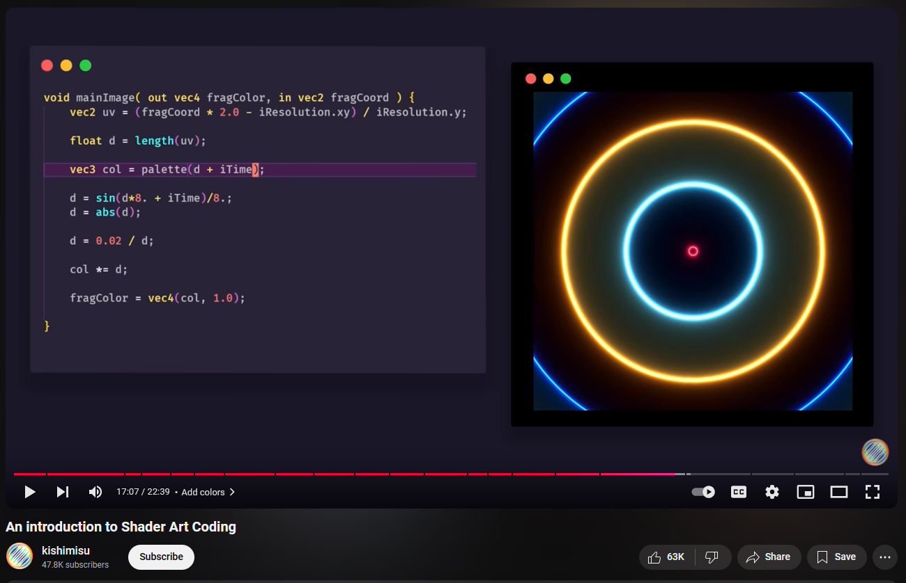
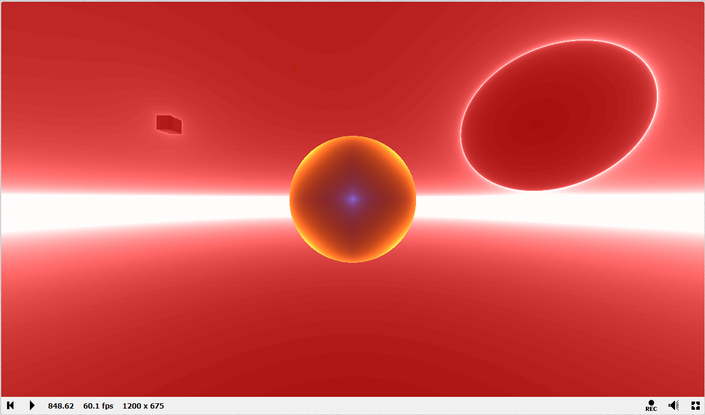
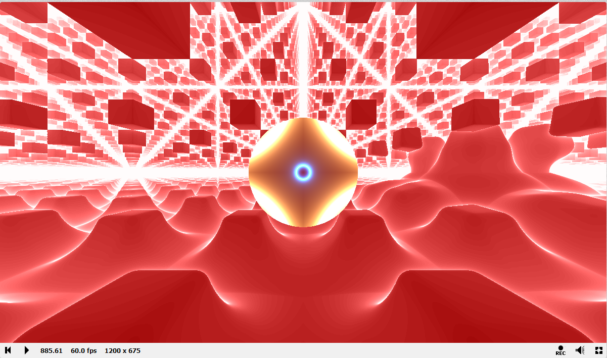
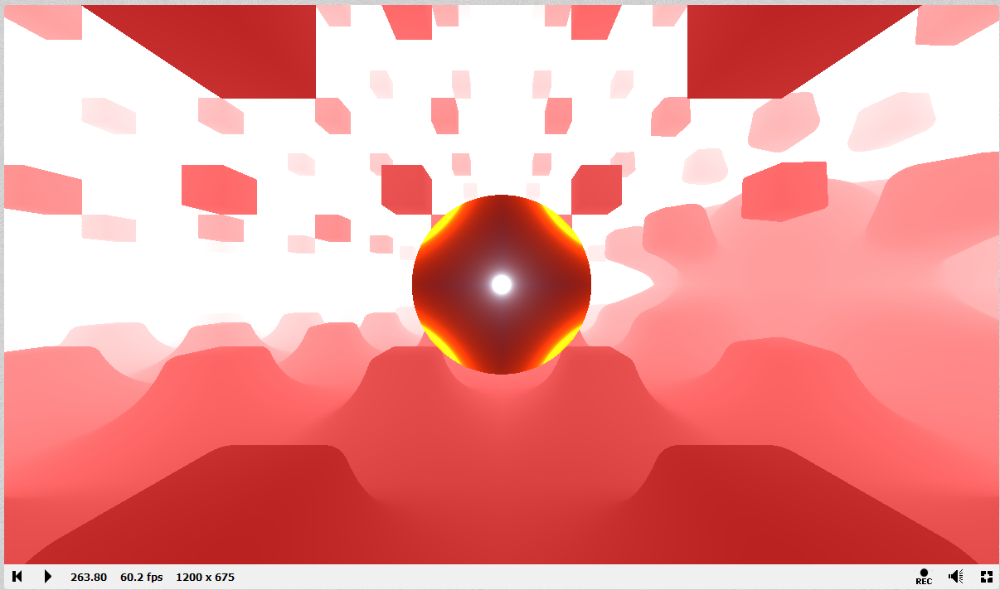

## Link: https://www.shadertoy.com/view/lfcfR2
## Process
For this Shadertoy project, I first referenced CSE 167's last discussion for the quarter.  I followed up until we coded the red circle in the middle.  Then, I decided that I wanted to try to have some shapes move across the screen. Originally, I wanted to upload a character model from Blender and animate that but Shadertoy is pure coding and math, so modeling more complex shapes would be super difficult as a beginner.  

I watched the first two Shadertoy tutorials by kishimisu and decided to blend elements from both videos.  First, I wanted to see if I could make my red circle more interesting, so I tried to get a strobing light effect from [this video](https://www.youtube.com/watch?v=f4s1h2YETNY).  At the center of the screen, imagine there is a black circle pulsing with different inner rings of neon lights (I do not have visuals for the early stages of development).  
> Inspiration: 

Great, now, I wanted to use SDFs from Inigo Quilez.  I chose to render an oblong sphere and a 3D rectangle and have them orbiting the flat circle in the center.  While the kishimisu tutorial only showed how to move an object horizontally from left to right, I experimented with `cosine` and `sine` at various x, y, and z coordinates.  I was also inspired to have a cool effect once the two SDFs collided with each other and used a smin() function from kishimisu to create a smooth blending and engulfing upon collision.  I attempted to use a subtraction function as well to create an indent upon collision but could not figure it out.  The subtraction function seemed to delete one shape each time, so I abandoned this idea.

At this point, please imagine two gray shapes orbiting a strobe light that meld together upon impact, kinda boring right?  

Next, I wanted to add more visual interest to the scene, so it's time to generate more shapes! I used [kishimisu's](https://www.youtube.com/watch?v=khblXafu7iA) video to help me use space repetition and tried to fill the background with cubes. At first, I only achieved adding a ground for the two shapes to rise and sink into, but this created a nice bright horizon. 
> 

Eventually, I was able to generate mini cubes into the scene.  Somewhere along the line of development, I lost the rectangle, but instead, I created a diffused cloud which I believe is the sphere, moving counterclockwise. This murky cloud had this effect of swallowing the little cubes and moving like liquid. 
> A `.gif` would be better sorry.
> 
> Pretend you can see a murky red cloud on the right, moving counter-clockwise. 

At the center of a black circle, you can see a star shape.  Wait, that wasn't there before...You are **not** hallucinating! I also added more subdivisions and contrast to make the lights more intriguing.  Now, the black circle in the center has stars and inner rings of light, in addition to everything else I mentioned before. 

One thing I wanted to fix in this version of the project was the busy-ness.  There were too many white spaces, the "light" is too bright.  I needed less red.  I watched kishimisu again and cleaned up.
> 

The scene was good, but I wanted to add a little more.  I wanted to add one or two more colors for the scene to be less monochromatic. I needed help, so I found another video from [The Art of Code](https://www.youtube.com/watch?v=rvDo9LvfoVE&list=PLGmrMu-IwbguU_nY2egTFmlg691DN7uE5&index=31).  With this guidance, I experimented with a version of the `hash()` function for randomness and color.
> Here I tried to make the repeated cubes have more varied colors, but the code resulted in a scene that repeated the center circle. I like how the lights in each section of the screen line up to create bigger circles.  Ultimately, however, I did not choose this route for the final product.
>
> 

While I experimented with psuedo-randomness and color, I also wanted to add one more animation.  This lead me to use `cosine and iTime` to elongate the cubes.  The speed and impact the cubes make feels powerful, like hammering.  Also, now the cubes create a frame around the black circle of light where a liquifying cloud moves in the background. 
> 

Am I done yet? Nope, as I kept gazing at this animation, I realized there were too many colors, which brings me to the final version of this project for CSE 167.  I was able to use the `hash()` function of the `floor(uv)` to split up the screen into different regions and set each region to be alternating colors of yellow and gray. These colors allow the strobe circle in the middle to stand out and blend back into the background and the horizon of light. Once you get tired of the neon lights and the pounding cubes, you will notice something opaque gliding about, risinig and sinking into the yellow-gray ground. 
> 
> *View the code [here](https://www.shadertoy.com/view/lfcfR2).*

## Next Steps
I am satisfied with the result, but I would like to keep improving! The writeup and videos I've watched all showcased so many awesome projects.  Some of them do not even have that many lines of code, and I am amazed that it's all just math. Some creators showcased projects of realistic environments or moving character animations, so I am inspired to learn how to optimize and create even cooler effects and images.  

